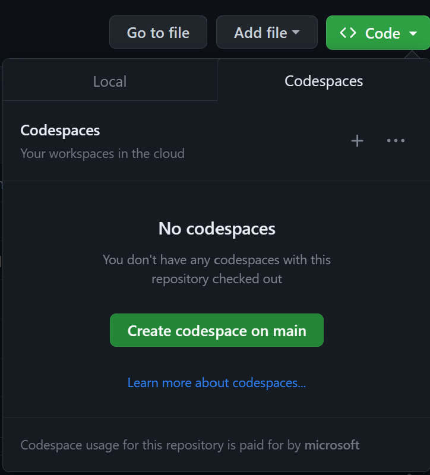

# Polyglot Notebook - the new way to teach

This repo shows how you can teach several courses within the computer science space. It's also a 0-config environment where it's all setup for you and you can use a service like GitHub Codespaces to get started in seconds.

## Anatomy of this repo

- `.devcontainer/` a directory containing needed files for this to run on GitHub Codespaces
    - `Dockerfile`, installs the needed runtime, in this case .NET 7
    - `decontainer.json`, contains instructions on what extensions to install when you boot up your Codespaces environment.

- `samples/` a samples directory showcasing different Notebooks that shows how you can teach various courses.
    - `javascript.dib`, shows how you can teach the JavaScript programming language.
    - `csharp.dib`, shows how you can teach the C# programming language.
    - `frontend.dib`, shows how you can teach "frontend" meaning things such as HTML and CSS
    - `api.dib`, shows how you can teach building an API. It has support for setting up backend routes and invoke the same.

## Run repo

To run this repo, take the following steps:

1. Fork this repo
1. in your forked repo select "Code" and select "Create codespace on main"

You should now have an environment ready to use. See below video on what you're able to do:

## References

- Polyglot Notebooks
- Mermaid
- Codespaces